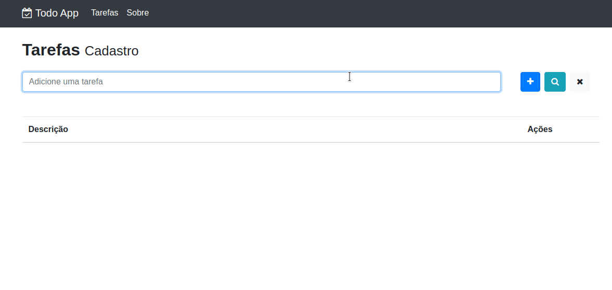

<p align="center">
  <a href="#technologies">Technologies</a>&nbsp;&nbsp;&nbsp;|&nbsp;&nbsp;&nbsp;
  <a href="#the-goal">The goal</a>&nbsp;&nbsp;&nbsp;|&nbsp;&nbsp;&nbsp;
  <a href="#how-to-use">How To Use</a>&nbsp;&nbsp;&nbsp;|&nbsp;&nbsp;&nbsp;
  <a href="#license">License</a>
</p>
<p align="center">
    
</p>

## Technologies

This project was developed at [React course from Cod3r](https://www.cod3r.com.br/courses/react-redux-fundamentos-e-2-apps-do-absoluto-zero) with the following technologies:

- [Axios](https://github.com/axios/axios)
- [Babel](https://babeljs.io/)
- [Bootstrap](https://getbootstrap.com/)
- [Cross-env](https://www.npmjs.com/package/cross-env)
- [Docker](https://www.docker.com/)
- [Express](https://expressjs.com/)
- [Font awesome](https://fontawesome.com/)
- [Mongoose](https://mongoosejs.com/)
- [Node-restful](https://www.npmjs.com/package/node-restful)
- [Nodemon](https://nodemon.io/)
- [Pm2](https://www.npmjs.com/package/pm2)
- [ReactJS](https://reactjs.org/)
- [React router](https://reacttraining.com/)
- [Styled-components](https://styled-components.com/)
- [Webpack](https://webpack.js.org/)

## The goal

This project was made with the intent to create a React project from the beginning without using [create-react-app](https://create-react-app.dev/), so I've configured Webpack in every piece needed before of start coding. On the server-side, I've created an API that communicates with a MongoDB instance to store the tasks generated on Front-end and serve the static files.

## How to use

```bash
# Clone this repository
$ git clone git@github.com:diglopes/todo-list-react.git

# Go into the repository
$ cd todo-list-react

# Install dependencies
$ yarn install

# Run the app
$ yarn deploy
```

## License

This project is under the MIT license. See the [LICENSE](https://github.com/lukemorales/gobarber-api/blob/master/LICENSE) for more information.